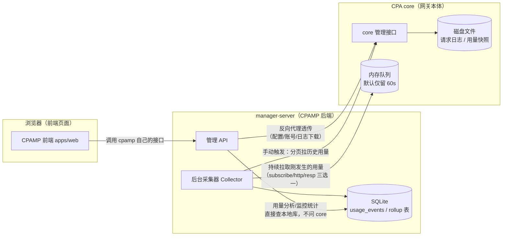
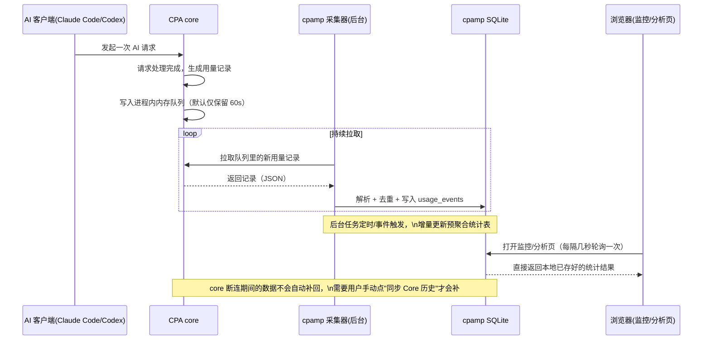
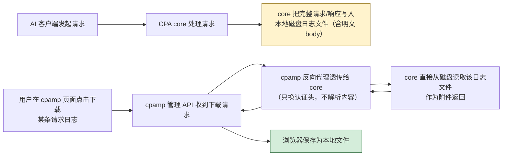

# CPAMP 数据架构：数据到底从哪来、存在哪

面向对象：第一次接触这个仓库、想搞清楚"面板上的数字/日志到底是怎么来的"的开发者或运维人员。
不要求先读源码，但会在关键处标出文件路径，方便你需要深入时直接跳过去看代码。

## 一句话说清 CPAMP 是什么

**CPA（core）** 是实际转发 AI 请求的网关本体：Claude Code、Codex 这些客户端把请求发给它，
它再转发给上游 AI 服务商，同时在请求过程中产生用量、日志等运行数据。

**CPAMP（本仓库，Manager Server + 前端）** 是 CPA 的管理面板，本身不转发任何 AI 请求，只做两件事：

1. 把 CPA 暴露的管理接口"代理"给浏览器用（配置、账号操作、日志下载等）。
2. 主动去 CPA 那边"采集"用量数据，存到自己的数据库里，做成可查询的统计报表。

也就是说，CPAMP 是 CPA 的"仪表盘 + 数据仓库"，不是 CPA 的替代品；关掉 CPAMP，CPA 本身照常转发请求。

## 三层架构怎么串起来

简单理解：

- **浏览器只认 cpamp**，从不直接连 core。
- cpamp 后端对不同类型的请求走两条完全不同的路：
  - 一部分（配置、账号操作、日志下载等）是**纯转发**，cpamp 自己不处理内容，原样转给 core、再原样把结果传回浏览器；
  - 另一部分（用量/监控统计）是 cpamp 自己**主动去 core 采数据、存进自己的 SQLite，之后所有查询都只读自己的库**，不再去烦 core。

## 逐类数据从哪来：一张表说清楚

| 数据项 | 来源方式 | core 侧从哪出 | cpamp 存哪 |
| --- | --- | --- | --- |
| 监控中心"实时"用量事件 | 走队列（后台常驻采集，持续拉取） | core 每次请求结束后把用量记录写进进程内内存队列（对外伪装成 Redis 协议，默认只保留 60 秒） | 写入 SQLite `usage_events` 表，按内容算出的唯一指纹去重 |
| 用量分析页 / 监控中心统计图表 | 本地计算（查自己的库，不问 core） | 不直接读 core | 读 `usage_events` 明细表 + 两张预聚合表（按账号/按小时汇总），由后台任务定时增量算好 |
| "同步 Core 历史"按钮 | 主动拉取 API（用户手动点一次） | core 内存里的历史用量统计（会定期存一份磁盘快照兜底，重启不丢） | 同样写入 `usage_events`，和上面两条走同一套去重逻辑，可以放心重复点、不会重复计数 |
| 请求错误日志列表/下载、单条请求日志下载、运行日志 /logs | 反向代理透传，cpamp 完全不解析内容 | core 直接读磁盘上的日志文件（按文件名规则查找） | 不落库、不落地；浏览器下载的文件是 core 磁盘上的原文件 |
| 账号列表 / 配额快照 | 反向代理透传 | core 实时返回（配额数来自 core） | 不落库 |
| 连接配置（上游 core 地址 + core 管理密钥） | cpamp 本地存 | — | SQLite `settings` 表（管理密钥加密存储） |
| 模型价格表 | cpamp 本地存 + 可从外部源同步 | 不来自 core（从 LiteLLM / OpenRouter 等第三方价格源拉） | SQLite `model_prices` 表；成本计算读它 |
| 认证文件（账号凭证） | 前端浏览/增删走反代；内部自动化任务直连 core | core | 原文不落库，只落地派生的判断结果（`account_action_candidates` 表） |
| 其余管理接口（连通配置、插件、reload 等） | 反向代理透传 | core 对应管理接口 | 不落库 |

## 两条路径分别讲清楚

### 路径一：透明反向代理（"帮你把话带过去"）

像日志下载、账号操作这些接口，cpamp 后端本质上是个"传话的"：浏览器发给 cpamp，
cpamp 把请求原样转发给 core（只是把认证头换成保存好的管理密钥），再把 core 的响应原样传回浏览器。

cpamp 后端在这个过程里**不解析、不存储**任何内容。比如"下载某条请求的完整日志文件"，
文件的实际读取和明文内容都发生在 core 那一侧的磁盘上；cpamp 只是搭了个桥，浏览器下载后
文件保存在你自己电脑上，cpamp 服务器上什么都没留下。

### 路径二：主动采集 + 落库（"自己记账"）

用量和监控相关的数据不走这套"传话"逻辑，而是 cpamp 后台有一个常驻的采集程序，
主动去问 core 要数据，拿到后解析、去重，写进自己的 SQLite 数据库。之后浏览器每次打开
监控/分析页面，问的都是 cpamp 自己的数据库，不会再去问 core。

这条路径又分两种触发方式：

1. **持续采集**：后台一直挂着连 core 的内存队列，只要 core 有新请求完成，很快就能拉到，
   适合看"最近发生了什么"。但这个队列默认只保留 60 秒，断线重连或程序重启期间产生的
   数据会跟着队列过期而丢失，不能靠它补历史。
2. **手动补历史**：你在监控中心点"同步 Core 历史"按钮，才会触发一次性地分批向 core
   要历史用量导出数据，直到取完为止。这条和上面持续采集的结果最终存进同一张表，
   使用同一套去重规则，两者可以同时跑，不会把同一条用量重复计两次。

## 谁能进来、请求怎么分流

**两道门（鉴权）：**

- **浏览器 → cpamp**：用一个管理员密钥（`cpamp_` 开头，部署时通过环境变量或密钥文件注入）。cpamp 后端校验请求头里的密钥是否和本地存的凭据一致，通过才放行。
- **cpamp → core**：cpamp 转发给 core 时，把请求头换成它自己保存的「core 管理密钥」。也就是说浏览器永远不接触 core 的密钥，只有 cpamp 后端持有。

**请求怎么分流（本地处理 vs 转发 core）：**

cpamp 后端收到请求后，按路径前缀决定走哪条路：少数几类前缀（用量 `usage`、监控 `monitoring`、报表 `dashboard`、模型价格 `model-prices`、Key 别名、账号处置候选、Codex 巡检）由 cpamp **自己本地处理**（读写自己的 SQLite）；其余 `/v0/management/*` 一律**透明转发给 core**。这就是前面「两条路径」在代码里的落点（判定逻辑在 `internal/service/proxy/service.go`，路由在 `internal/http/router/router.go`）。

## cpamp 自己的 SQLite 存了什么、没存什么

**存了什么（本地 SQLite，默认 `/data/usage.sqlite`，共 12 张表）：**

用量类：

- `usage_events`：每一条用量事件的明细（模型、token 数、耗时、是否失败等），是所有统计的原始真源。
- `usage_account_model_rollups` / `usage_dashboard_hourly_rollups`：按账号、按小时预先算好的汇总，让报表查询更快，不用每次扫全表。
- `usage_rollup_checkpoints`：后台统计任务的进度书签（算到哪了，好增量续算）。
- `dead_letter_events`：解析失败的用量负载（死信，便于排查）。

配置 / 业务类：

- `settings`：键值配置仓（连接配置、管理员凭据、自动化设置等，敏感值加密存）。
- `model_prices`：模型价格表（本地维护 + 可从外部源同步，成本计算读它）。
- `api_key_aliases`：API Key 的别名。
- `account_action_candidates`：自动化任务对账号的处置判断结果（如限流自动禁用候选）。
- `quota_cooldowns`：配额冷却记录。
- `codex_inspection_runs / _results / _logs`：Codex 巡检任务的运行 / 结果 / 日志。

**没存什么（容易误解的地方）：**

- **请求和响应的完整内容（body）目前完全不落库**。这些明文内容只存在于 core 那台机器的磁盘日志文件里；
  cpamp 只是把下载请求转发过去，从不读取或解析文件内容。
- 运行日志、错误日志文件本身也不落库，同样是转发到 core 磁盘上现读现传。
- "实时"这个说法要谨慎理解：监控页面看到的"实时刷新"，其实是浏览器每隔几秒去问一次 cpamp
  自己的数据库（客户端轮询），不是服务器主动推送，也不是每次都去问 core。

## 一条用量数据的完整旅程（时序图）

## 请求 body 日志当前的链路（流程图）

图中黄色框（core 磁盘文件）是 body 明文实际存放的唯一位置；cpamp 后端在
整条链路里（浅色的 E/F 两步）不做任何解析或落库，只做一次"带口令"的转发。

## 待确认 / 未验证事项

- 队列默认保留窗口写为 60 秒（可配置到 3600 秒）、"同步 Core 历史"每页默认 5000 条，均按调研读到的代码常量引用，未在当前生产环境实测每项的实际生效值。
- **请求 / 响应 body 的长期存档目前尚未实现**：body 明文只存在 core 磁盘日志里、会滚动删除；如何做可长期检索的 body 审计（存哪、谁存）正在评估，见交付台账的 8.4 项。

---

相关文档：面向运维/使用的说明见 `apps/cpamp/apps/docs/` 下的手册站点（如 `operations/manager-server` 一节）；本文件偏"内部数据从哪来"的架构解释，两者受众不同、可互为补充。
